# TechConf Registration Website

## Project Overview
The TechConf website allows attendees to register for an upcoming conference. Administrators can also view the list of attendees and notify all attendees via a personalized email message.

The application is currently working, but the following pain points have triggered the need for migration to Azure:
 - The web application is not scalable to handle user load at peak.
 - When the admin sends out notifications, it's currently taking a long time because it's looping through all attendees, resulting in some HTTP timeout exceptions.
 - The current architecture is not cost-effective.

In this project, you need to do the following:
- Migrate and deploy the pre-existing web app to an Azure App Service.
- Migrate a PostgreSQL database backup to an Azure Postgres database instance.
- Refactor the notification logic to an Azure Function via a service bus queue message.

## Dependencies

You will need to install the following locally:
- [Postgres](https://www.postgresql.org/download/)
- [Visual Studio Code](https://code.visualstudio.com/download)
- [Azure Function tools V3](https://docs.microsoft.com/en-us/azure/azure-functions/functions-run-local?tabs=windows%2Ccsharp%2Cbash#install-the-azure-functions-core-tools)
- [Azure CLI](https://docs.microsoft.com/en-us/cli/azure/install-azure-cli?view=azure-cli-latest)
- [Azure Tools for Visual Studio Code](https://marketplace.visualstudio.com/items?itemName=ms-vscode.vscode-node-azure-pack)

## Project Instructions

### Part 1: Create Azure Resources and Deploy Web App
1. Create a Resource group
2. Create an Azure Postgres Database single server
   - Add a new database `techconfdb`
   - Allow all IPs to connect to database server
   - Restore the database with the backup located in the data folder
3. Create a Service Bus resource with a `notificationqueue` that will be used to communicate between the web and the function
   - Open the web folder and update the following in the `config.py` file
      - `POSTGRES_URL`
      - `POSTGRES_USER`
      - `POSTGRES_PW`
      - `POSTGRES_DB`
      - `SERVICE_BUS_CONNECTION_STRING`
4. Create `App Service plan`.
5. Create a `Storage account`.
6. Deploy the web app

### Part 2: Create and Publish Azure Function
1. Create an Azure Function in the `function` folder that is triggered by the service bus queue created in Part 1.

      **Note**: Skeleton code has been provided in the **README** file located in the `function` folder. You will need to copy/paste this code into the `__init.py__` file in the `function` folder.
      - The Azure Function should do the following:
         - Process the message which is the `notification_id`.
         - Query the database using `psycopg2` library for the given notification to retrieve the subject and message.
         - Query the database to retrieve a list of attendees (**email** and **first name**).
         - Loop through each attendee and send a personalized subject message.
         - After the notification, update the notification status with the total number of attendees notified.
2. Publish the Azure Function

### Part 3: Refactor `routes.py`
1. Refactor the post logic in `web/app/routes.py -> notification()` using servicebus `queue_client`:
   - The notification method on POST should save the notification object and queue the notification id for the function to pick it up
2. Re-deploy the web app to publish changes

## Monthly Cost Analysis

Complete a month cost analysis of each Azure resource to give a total costs using the table below:

| Azure Resource              | Service Tier             | Monthly Cost |
| --------------------------- | ------------------------ | ------------ |
| _Azure PostgreSQL Database_ | Basic, 1 vCore(s), 50 GB | $24.82       |
| _Azure Service Bus_         | Basic                    | $0.05        |
| _Azure App Service_         | Basic (B1), Linux        | $13.14       |
| _Azure Storage_             | General Purpose V2       | $2.12       |
| _Azure Function App_        | Consumption              | $1.80        |


See [pricing calculator](https://azure.com/e/df876a84f49e416fa26d56224112d9c8) for more details.

## Architecture Explanation

The previous implementation of the application had the following pain points:

1. The web application is not scalable to handle user load at peak
2. When the admin sends out notifications, it's currently taking a long time because it's looping through all attendees, resulting in some HTTP timeout exceptions
3. The current architecture is not cost-effective

Through the migration to a microservice architecture and refactoring the notification logic to an Azure Function via a service bus queue message, the different components of the web application are decoupled. This makes it more scalable and sending out of notifications does not lead to HTTP timeout exceptions anymore.

The migration to an Azure App Service and Azure Postgres database instance improves cost-efficiency.

## Screenshots

### Migrate Web Applications

Screenshot of Azure Resource showing the App Service Plan:

*The App Service Plan created and listed below*

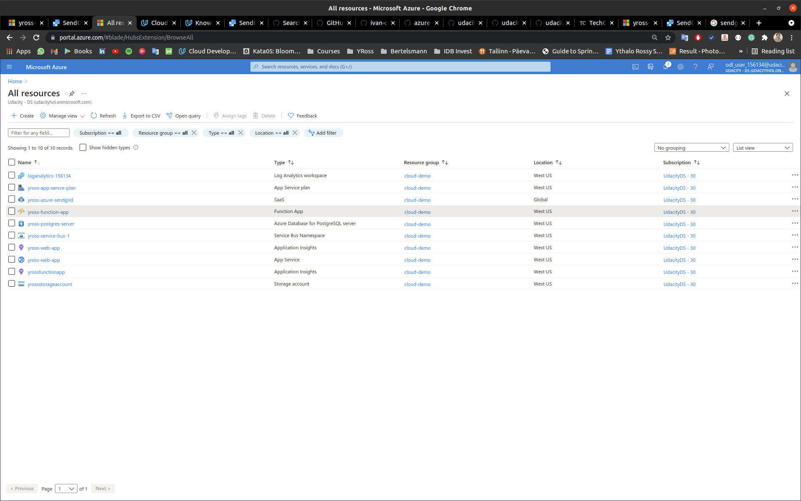

Screenshot of the deployed Web App running:

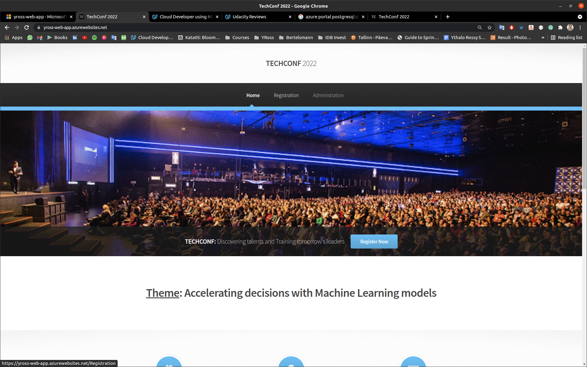

Screenshot of the deployed Web App running (Overview):

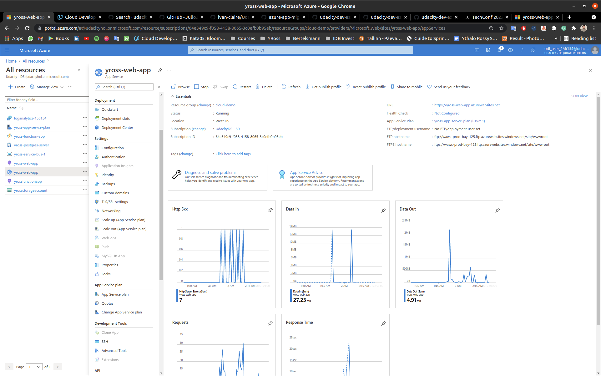

### Migrate Database

Screenshot of the Azure Resource showing the Azure Database for PostgreSQL server:


Screenshot of the Azure Resource showing the Azure Database for PostgreSQL server Firewall Rules:


Screenshot of the Postgres Administrator restoring the database:

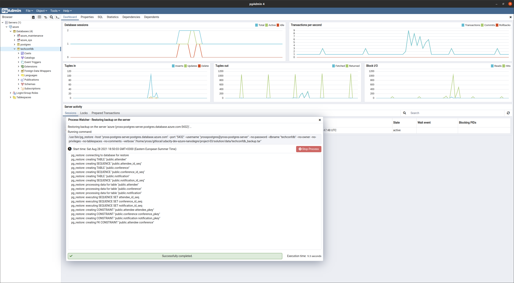

Screenshot of the Attendees Table

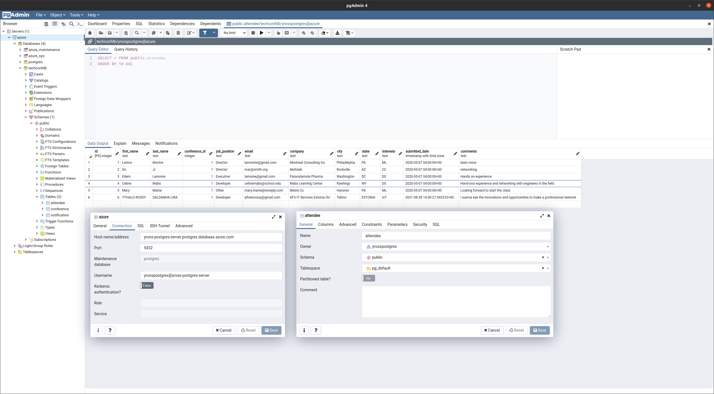

Screenshot of the Conference Table

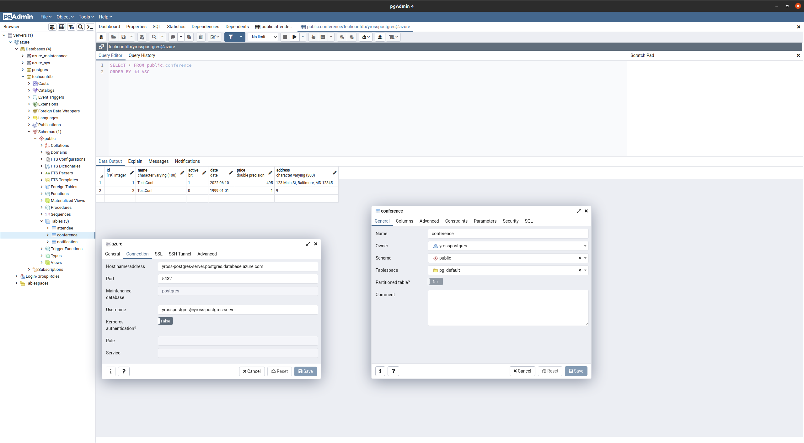

Screenshot of the Web App successfully loading the list of attendees and notifications from the deployed website:


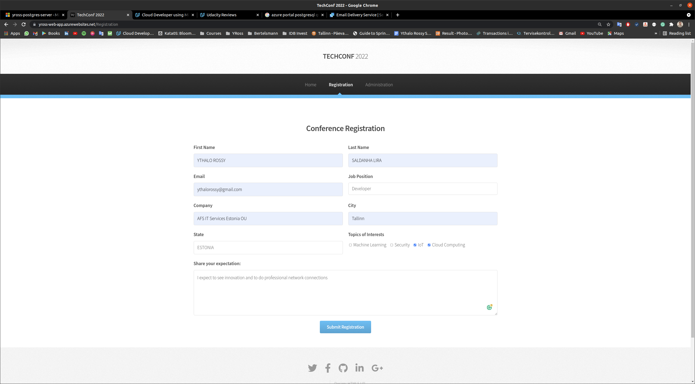

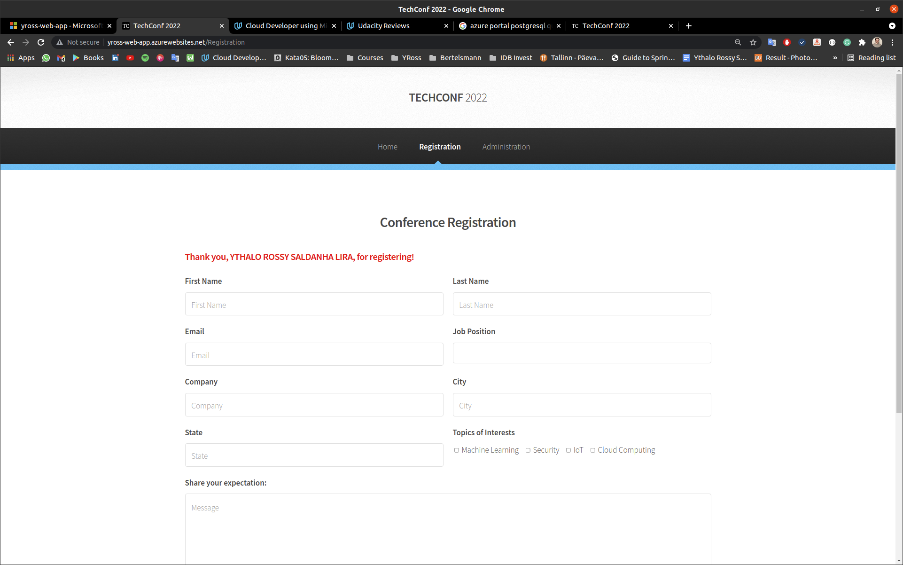


### Migrate Background Process - 4 Screenshots

Screenshot of the Azure Function App running in Azure, showing the function name and the function app plan:


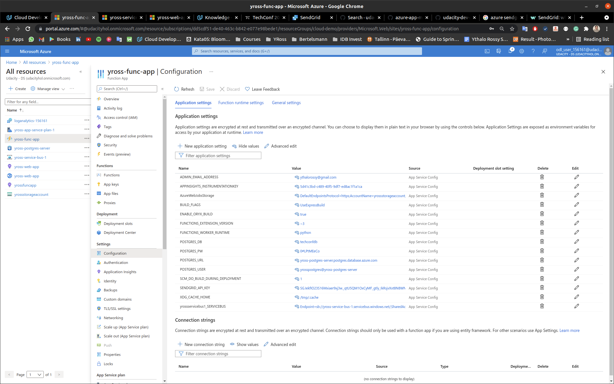


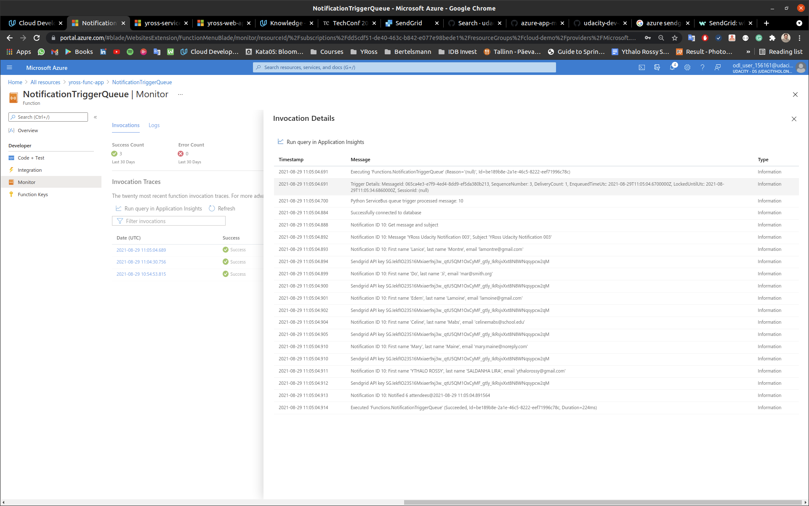

Screenshot of the Notification Table after a few notifications sent.


Screenshots of submitting a new notification (filled out Send Notification form):


Screenshot of the Email Notifications List showing the notification status as "Notifications submitted":

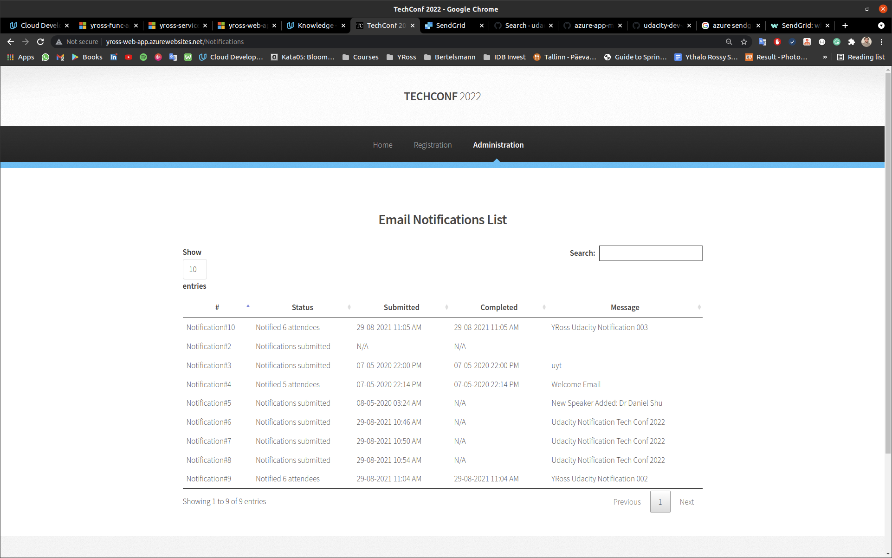

Screenshot of the Email Notifications List showing the notification status as "Notified X attendees":


Screenshot showing Service Bus 

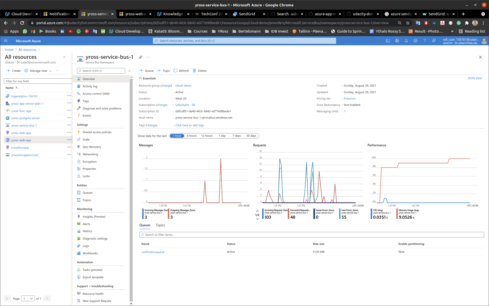

Screenshot showing Service Bus - Queue Notification


## Clean-up

Clean up and remove all services, or else you will incur charges. 
The best option is to delete the `source group` where the resources were created.

```bash
az group delete --name <SOURCE_GROUP_NAME>
```

## References

- [Quickstart: Create an Azure Database for PostgreSQL server by using the Azure CLI](https://docs.microsoft.com/en-us/azure/postgresql/quickstart-create-server-database-azure-cli)
- [Quickstart: Create, download, and list blobs with Azure CLI](https://docs.microsoft.com/en-us/azure/storage/blobs/storage-quickstart-blobs-cli)
- [Quickstart: Create a Python app using Azure App Service on Linux](https://docs.microsoft.com/en-us/azure/app-service/quickstart-python?tabs=bash&pivots=python-framework-flask)
- [Work with Azure Functions Core Tools](https://docs.microsoft.com/en-us/azure/azure-functions/functions-run-local?tabs=linux%2Cpython%2Cbash)
- [Total Cost of Ownership (TCO) Calculator](https://azure.microsoft.com/en-us/pricing/tco/calculator/)
- [Azure pricing](https://azure.microsoft.com/en-us/pricing/)
- [Pricing calculator](https://azure.microsoft.com/en-us/pricing/calculator/)

## Requirements

According to the [Project Rubric](https://review.udacity.com/#!/rubrics/2824/view).

## License

- **[MIT license](http://opensource.org/licenses/mit-license.php)**
- Copyright 2021 © [Ythalo Rossy](https://github.com/ythalorossy).
